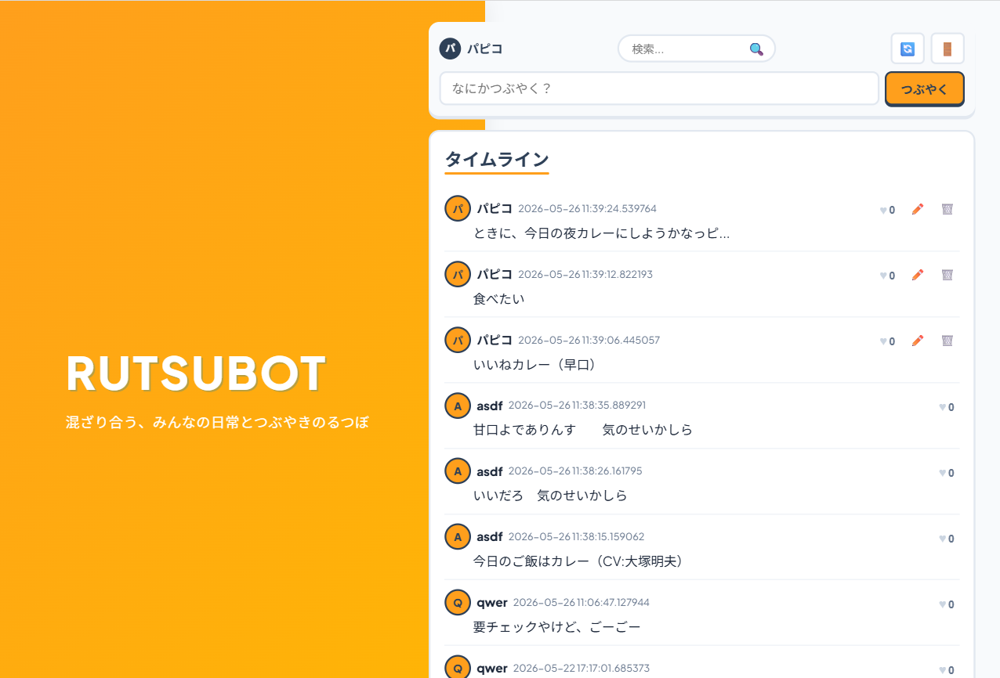
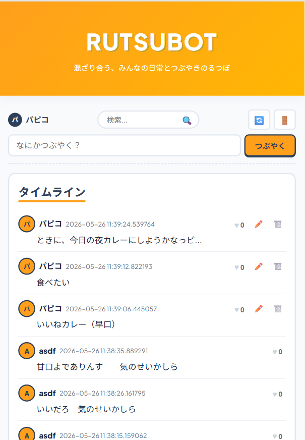

# 🍯 RUTSUBOT (ルツボット)

> **カオスに混ざり合う、みんなの日常とつぶやきのるつぼ。**

RUTSUBOT は、Java Servlet / JSP をベースに作られた、リアルタイム感覚でコミュニケーションを楽しめるモダンなつぶやきWebアプリケーションです。
大人でも楽しめる「POPで明るい洗練されたUI」と、スクロール追従型の投稿フォーム、会話に没入できる「超高密度レイアウト」が特徴です。

---

## 📸 スクリーンショット

*※アプリ起動後、以下の画像を撮影して `images/` ディレクトリに保存してください。README上で自動的に表示されるようになります！*

### 💻 PC表示 (左40%固定ロゴ ＆ 右60%スクロール)

*(撮影手順: PCブラウザで画面最大化し、左側のイエローグラデーションのサイドバーと右側のタイムラインが綺麗に2カラムで並んでいる様子を撮影してください)*

### 📱 スマホ表示 (モバイルファースト・1カラム)

*(撮影手順: ブラウザのデベロッパーツールで「iPhone 12/13/14」等のスマートフォン表示にし、1カラムに美しく折りたたまれた画面を撮影してください)*

---

## ✨ 主な機能

1. **リアルタイム・タイムライン**
   - 登録されたすべてのつぶやきを時系列でスムーズに閲覧可能。
   - 余白を極限まで詰めたチャット風高密度デザインにより、スクロールの手間なく何通もの会話を一目で追うことができます。

2. **スクロール追従（Sticky）投稿＆検索**
   - 画面上部にユーザー情報、インライン型虫眼鏡検索、投稿フォームが常に追従（固定）表示されます。
   - タイムラインをどれだけ下にスクロールしていても、スクロールを戻すことなく、その場ですぐにつぶやいたり検索したりできます。

3. **スマートアバター ＆ インラインアクション**
   - 投稿者のイニシャル（名前の最初の1文字）をPOPなサークルアバターとして自動生成・表示。
   - アバターと同一行に「ユーザー名」「日時」「いいね（♥）」「編集/削除」のアクションをすべて横並びで配置。縦幅を極限までスマートにしています。

4. **安心のセキュリティ ＆ 投稿管理**
   - セッション管理によるログイン/ログアウト認証。
   - 自分が投稿したつぶやきのみ「編集（✏️）」「削除（🗑️）」ができる認可保護機能。
   - セッション切れの状態で投稿してもエラー画面（500エラー）にならず、安全にログイン画面へと案内するセッションガード機能を完備。

5. **ランダム・デコレーション（お楽しみ機能）**
   - つぶやき投稿時に、テキストがランダムで楽しく装飾されるロジックを搭載。

---

## 🎨 UI/UXデザインへのこだわり

「かわいい」「かっこいい」「こどもっぽい」という安易なデザインに逃げず、**「アクティブで知的な大人のPOP」**を表現しました。

* **洗練されたカラーパレット**:
  - **マンゴーオレンジ (`#FF9F1C`)**: ポジティブで明るい雰囲気を醸し出すキーカラー。
  - **スレートネイビー (`#2E4057`)**: 全体をシャープに引き締めるダークカラー。「こどもっぽさ」を完全に打ち消し、高いコントラストと視認性を担保します。
  - **清潔なライトグレー (`#F8FAFC`)**: ダークモードのような冷たい「かっこよさ」を避け、明るく健全なコミュニティの雰囲気を演出します。
* **高密度チャットスタイル**:
  - 本文をアバターの開始位置と揃えてインデント（左マージン32px）させることで、会話の流れが美しく整理されます。

---

## 🛠️ 技術スタック

* **バックエンド**: Java 17 / Jakarta EE (Servlet 6.0, JSP 3.0)
* **フロントエンド**: HTML5, Vanilla CSS3 (CSSカスタムプロパティを活用したフルスクラッチ構築)
* **データベース**: H2 Database (ファイル埋め込みモード)
* **Webサーバー**: Apache Tomcat 10.x
* **開発・ビルド環境**: PowerShell v7+

---

## 🚀 クイックスタート (起動方法)

本プロジェクトはビルドおよび起動プロセスが完全にスクリプト化されており、以下の手順だけで簡単に立ち上げることができます。

### 1. リポジトリのクローンと移動
```powershell
cd RUTSUBOT
```

### 2. サーバーのビルド ＆ 実行
PowerShellで以下のスクリプトを叩きます。（自動的にソースファイルのコンパイル、Tomcatサーバーのビルド、およびポート`8080`での起動が行われます）
```powershell
.\run.ps1
```

### 3. ブラウザでアクセス
起動が完了したら、以下のURLにアクセスしてください。
```http
http://localhost:8080/RUTSUBOT
```
*※新規ユーザー登録を行い、すぐにタイムラインをお楽しみいただけます！*

---

## 📂 プロジェクト構成

```text
RUTSUBOT/
├── src/main/java/          # Java ソースコード (サーブレット、ビジネスロジック、DAO、モデル)
├── src/main/webapp/        # Web アプリケーションリソース
│   ├── css/
│   │   └── style.css       # アプリケーション共通スタイル (高密度POPデザイン)
│   ├── WEB-INF/
│   │   ├── jsp/            # 各種表示画面テンプレート (main.jsp, loginResult.jsp 等)
│   │   └── web.xml         # サーブレット・フィルター等のルーティングマッピング
│   └── index.jsp           # トップページ (ログイン画面)
├── sql/                    # データベース初期化SQLスクリプト
├── db/                     # H2 データベース保存先
├── docs/                   # プロジェクト関連ドキュメント、実行ログ
│   └── logs/
│       └── execution_log.md# 開発・修正実行ログ
├── images/                 # スクリーンショット格納先（GitHub上での表示用）
├── build.ps1               # コンパイル・パッケージングスクリプト
└── run.ps1                 # ビルド ➔ サーバー起動自動化スクリプト
```

---

## ⚖️ ライセンス

このプロジェクトは [MIT License](LICENSE) の元で公開されています。
詳細は同梱されている `LICENSE` ファイルをご確認ください。
